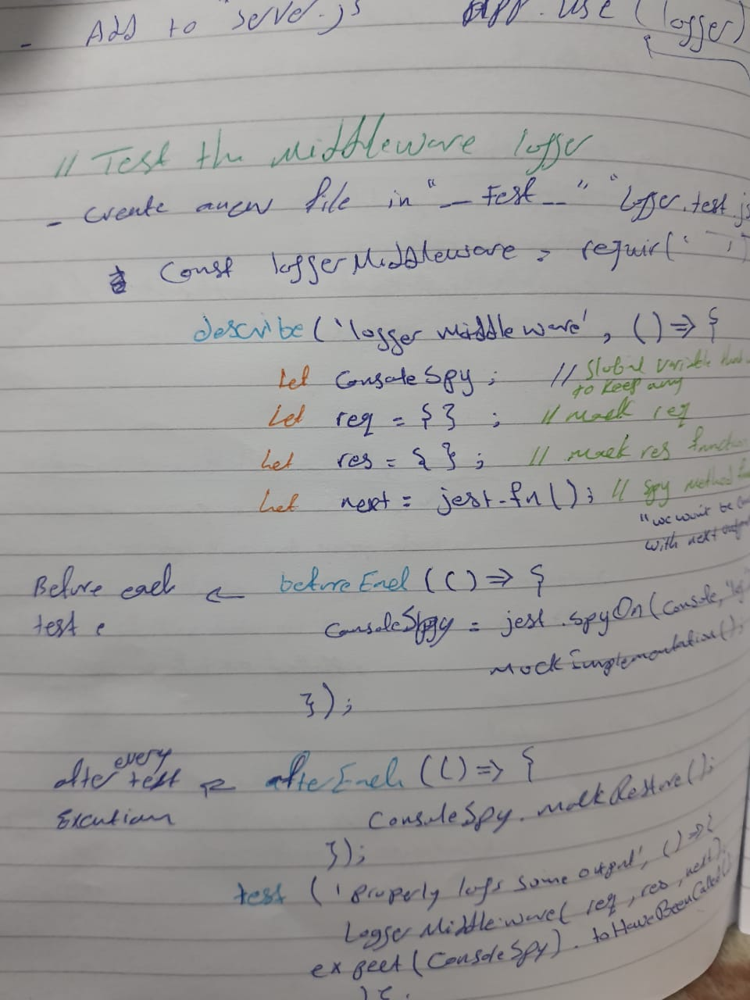

# LAB02 - Express

Author: Bayan Qutshan

* [Github actions](https://github.com/BianQt/basic-express-server/actions)
* [Pull-Request](https://github.com/BianQt/basic-express-server/pull/1)
* [bianqt-basic-express-server](https://bianqt-basic-express-server.herokuapp.com)


## Setup
```.env``` requirements
```PORT``` - Port Number

## Running the app
```npm start``` / ```npm run dev```

Endpoint: ```/person?name=< name >```
Returns Object

{
  "name": "providing name"
}

## Tests
Unit Tests: npm run test
Lint Tests: npm run lint

## Notes


